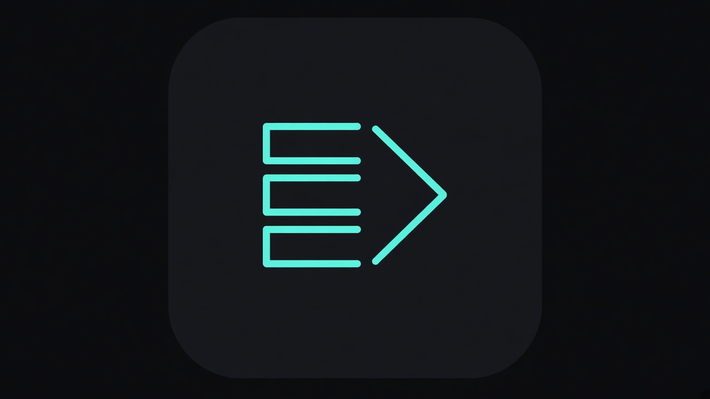
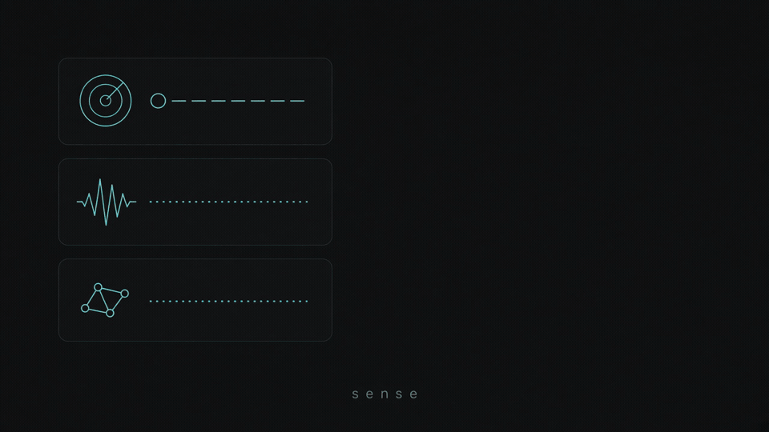

<p align="center">
  
</p>

<h1 align="center">r2s</h1>

<p align="center">
  <strong>↻ research → rank → ship</strong><br />
  JSON Schema contract for turning research signals into repo and library work.
</p>

<p align="center">
  
</p>

<p align="center">
  <a href="docs/SPEC.md"></a>
  <a href="LICENSE"></a>
  
</p>

---

## What this is

**r2s** is a small, versioned contract — not an agent and not a framework.

You normalize research into **cards**, **rank** them with an explicit score, emit a fixed **handoff** for whoever builds, then record an **outcome** so the next cycle is smarter.

v0.1.0 ships **schemas + docs + examples only**. Runtimes come later and must obey this contract.

## Quick start

1. Read the normative rules: [`docs/SPEC.md`](docs/SPEC.md)
2. Copy [`examples/board.example.json`](examples/board.example.json)
3. Validate with any JSON Schema Draft 2020-12 validator against [`schemas/`](schemas/)

## Loop

| Stage | Artifact | Role |
|-------|----------|------|
| Sense | `card` | Normalize a research signal |
| Rank | `board` + scoring rules | Order work; kill weak cards |
| Handoff | `handoff` | 7-part ship packet for implementers |
| Ship / learn | `outcome` | Close the loop |

**Score**

```text
S = (novelty × evidence_strength × usability × dependency_fit)
  / (hours + compute_cost + blast_radius)
```

Kill when usability or dependency fit ≈ 0, or `target_repo` is missing at design+.

## Layout

```text
schemas/          card · board · handoff · outcome · scoring
docs/SPEC.md      normative rules
docs/brand/       icon · social · README loop GIF
examples/         worked board + handoff (this repo as the sample)
```

## Brand

| | |
|-|-|
| Mark | stacked cards → chevron (cyan on charcoal) |
| Emoji | ↻ |
| Accent | `#5eead4` on `#0f1115` |

## Security

Card fields are **untrusted data**. Validators must not execute claim or evidence strings. This repo holds no credentials and no network clients.

## License

[MIT](LICENSE)
