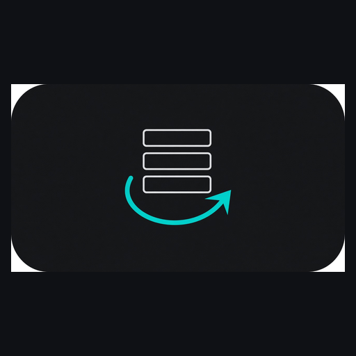

<p align="center">
  
</p>

<h1 align="center">r2s</h1>

<p align="center"><b>research → rank → ship</b></p>

<p align="center">
  Schema + CLI that turns research into ranked cards, handoffs, and ship outcomes.
</p>

<p align="center">
  
</p>

<p align="center">
  <a href="https://pypi.org/project/r2s/"></a>
  <a href="LICENSE"></a>
  
</p>

## Install

```bash
pip install r2s
r2s --help
```

## Loop

| | Artifact | Job |
|-|----------|-----|
| Sense | `card` | Normalize a signal |
| Rank | `board` | Score & kill weak work |
| Handoff | `handoff` | Fixed packet for builders |
| Ship | `outcome` | Did the earn hypothesis hold? |

```text
S = (novelty × evidence × usability × fit) / (hours + compute + blast)
```

## Experiment contract (xpc)

`r2s xpc` validates the experiment contract: hypothesis → protocol → result, plus run records. It was the separate `xpc` repo and now lives here as the `r2s.xpc` module.

```bash
pip install .   # from a clone, until the next r2s release
r2s xpc validate examples/xpc/gdk9-conserve-vs-naive
```

## Layout

| Path | What it is |
|------|------------|
| `src/r2s/` | Runtime and CLI: `r2s rank`, `r2s score`, `r2s handoff` |
| `src/r2s/xpc/` | Experiment contract module, `r2s xpc validate` (formerly `ao3575911/xpc`) |
| `schemas/` | Normative r2s schemas; `schemas/xpc/` holds the experiment schemas |
| `examples/` | r2s examples; `examples/xpc/` holds experiment dogfood runs |
| `docs/` | Spec and brand assets; [`docs/xpc.md`](docs/xpc.md) is the xpc guide |
| `tests/` | Runtime, schema parity and xpc tests |

## Docs

- Spec → [`docs/SPEC.md`](docs/SPEC.md)
- Schemas → [`schemas/`](schemas/)
- Experiment contract → [`docs/xpc.md`](docs/xpc.md)
- Examples → [`examples/`](examples/)
- Changelog → [`CHANGELOG.md`](CHANGELOG.md)

## License

[MIT](LICENSE)
